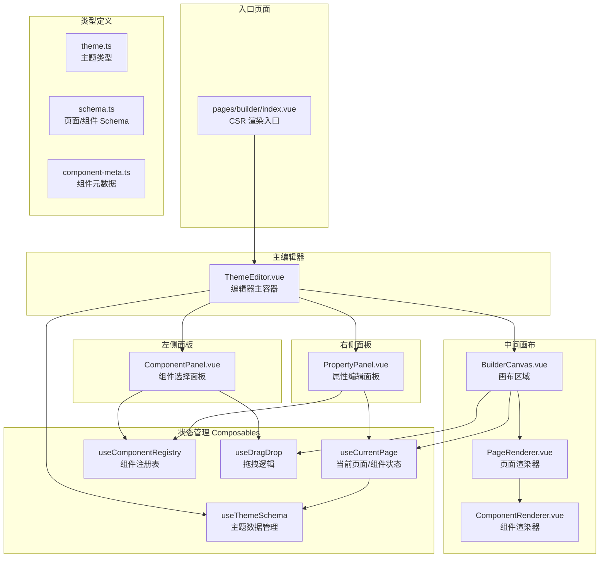
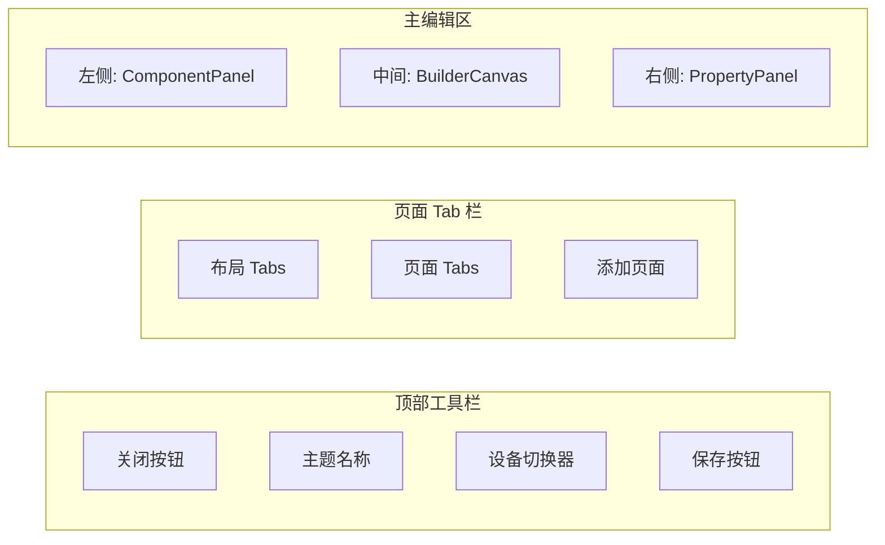
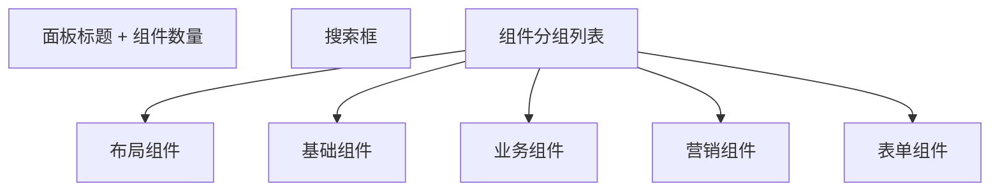
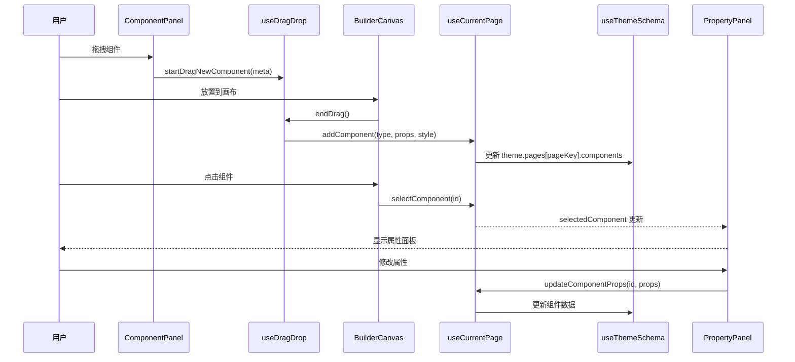
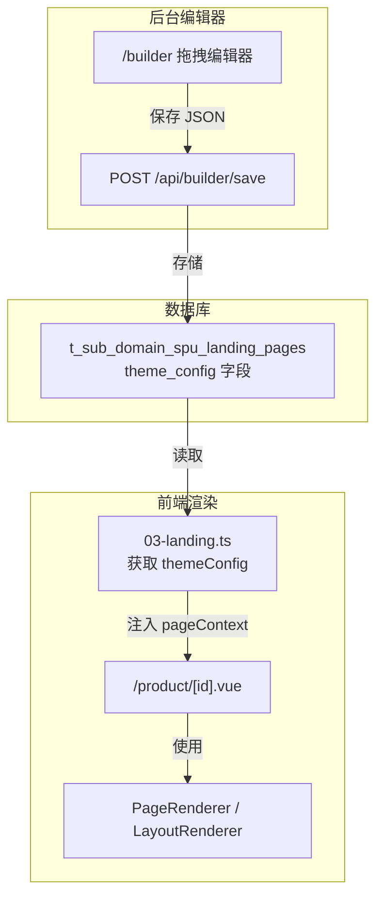

# 主题编辑器架构说明文档

## 整体架构



---

## 目录结构

```
app/
├── pages/
│   ├── builder/
│   │   └── index.vue              # 编辑器入口页面 (CSR)
│   └── product/
│       └── [id].vue               # 产品页面（前端渲染）
├── components/
│   ├── builder/                   # 编辑器专用组件
│   │   ├── ThemeEditor.vue        # 编辑器主容器
│   │   ├── ComponentPanel.vue     # 左侧组件选择面板
│   │   ├── BuilderCanvas.vue      # 中间画布区域
│   │   ├── PropertyPanel.vue      # 右侧属性编辑面板
│   │   └── DeviceSwitcher.vue     # 设备切换器
│   ├── renderer/                  # 渲染器（前后端共用）
│   │   ├── PageRenderer.vue       # 页面渲染器
│   │   ├── LayoutRenderer.vue     # 布局渲染器
│   │   └── ComponentRenderer.vue  # 组件渲染器
│   ├── shop/                      # 商城组件（自动注册）
│   │   └── *.vue                  # 业务组件
│   └── shop-layout/               # 布局组件（自动注册）
│       └── PageSlot.vue           # 页面内容占位符
├── composables/
│   ├── useThemeSchema.ts          # 主题数据管理
│   ├── useCurrentPage.ts          # 当前页面/组件状态
│   ├── useComponentRegistry.ts    # 组件注册表（元数据 + 实例）
│   ├── useDragDrop.ts             # 拖拽逻辑
│   ├── useDeviceDetect.ts         # 设备检测
│   ├── useDataContext.ts          # 数据上下文（数据绑定）
│   ├── usePageContext.ts          # 页面上下文（SSR 数据）
│   └── useResponsive.ts           # 响应式样式计算
├── plugins/
│   └── register-components.ts     # 组件自动注册插件
├── types/
│   ├── builder.ts                 # 统一导出
│   ├── theme.ts                   # 主题类型定义
│   ├── schema.ts                  # 页面/组件 Schema
│   ├── component-meta.ts          # 组件元数据类型
│   ├── events.ts                  # 事件类型
│   ├── data-context.ts            # 数据上下文类型
│   └── page-context.ts            # 页面上下文类型
└── constants/
    ├── index.ts                   # 常量统一导出
    ├── breakpoints.ts             # 断点配置
    └── components/
        └── index.ts               # 组件元数据注册
```

---

## 核心模块说明

### 1. 入口页面 - `pages/builder/index.vue`

**职责**：
- 作为编辑器的入口，**禁用 SSR**（`layout: false`）
- 从 URL query 获取 `subDomainId`、`spuId`、`landingType`
- 调用 `useThemeSchema` 初始化主题
- 离开页面时提示未保存更改

**访问方式**：
```
/builder?subDomainId=1958023833603&spuId=1738449914882&landingType=LAND
```

---

### 2. 主编辑器容器 - `ThemeEditor.vue`

这是整个编辑器的**布局骨架**，包含：



**关键功能**：

| 功能 | 说明 |
|------|------|
| **页面 Tab 管理** | 支持布局（layout-xxx）、必选页面（home/product/orderResult/article）、可选页面（checkout）、自定义页面（custom-xxx） |
| **面板宽度可拖拽** | 左右面板宽度可通过 `startResize` 拖拽调整，并持久化到 `localStorage` |
| **布局关联** | 页面可以选择使用哪个布局（layoutId） |

---

### 3. 核心 Composables（状态管理）

#### 3.1 `useThemeSchema` - 主题数据管理

**核心职责**：
- 管理整个 `ThemeSchema` 状态
- 提供主题的 CRUD 操作
- 管理全局样式、全局数据、页面、布局
- 导入/导出 JSON

**主要方法**：
```typescript
// 主题操作
initTheme(name: string): ThemeSchema
loadTheme(schema: ThemeSchema): void
updateThemeInfo(updates): void
clearTheme(): void

// 全局样式
updateGlobalStyle(updates: Partial<GlobalStyle>): void
resetGlobalStyle(): void

// 全局数据
addGlobalPreset(preset): boolean
removeGlobalPreset(dataSetId): void
addGlobalVariable(variable): boolean
updateGlobalVariable(key, updates): boolean
removeGlobalVariable(key): void

// 页面操作
getPageSchema(pageKey): PageSchema | undefined
updatePageSchema(pageKey, updates): void
addCustomPage(slug, name): CustomPageSchema
updateCustomPage(pageId, updates): void
removeCustomPage(pageId): void

// 收银台
enableCheckoutPage(): void
disableCheckoutPage(): void

// 布局管理
layouts: ComputedRef<LayoutSchema[]>
getLayout(layoutId): LayoutSchema | undefined
addLayout(name): LayoutSchema
updateLayout(layoutId, updates): void
removeLayout(layoutId): void
setPageLayout(pageKey, layoutId): void
setCustomPageLayout(pageId, layoutId): void

// 导入导出
exportTheme(): string
importTheme(json): boolean
markAsSaved(): void
```

#### 3.2 `useCurrentPage` - 当前页面/组件状态

**核心职责**：
- 追踪当前编辑的是哪个页面/布局（`currentPageKey`）
- 追踪当前设备类型（`currentDevice`）
- 追踪选中的组件（`selectedComponentId`）
- 提供组件的增删改查、移动操作

**主要方法**：
```typescript
// 状态
currentPageKey: Readonly<Ref<string>>
currentDevice: Readonly<Ref<DeviceType>>
selectedComponentId: Readonly<Ref<string | null>>

// 计算属性
isEditingLayout: ComputedRef<boolean>
currentLayout: ComputedRef<LayoutSchema | null>
currentPage: ComputedRef<PageSchema | null>
components: ComputedRef<ComponentNode[]>
selectedComponent: ComputedRef<ComponentNode | null>

// 页面/设备切换
switchPage(pageKey: string): void
switchDevice(device: DeviceType): void

// 组件选择
selectComponent(componentId: string | null): void

// 组件操作
addComponent(type, props, style, parentId?, index?): ComponentNode | null
updateComponentProps(componentId, props): void
updateComponentStyle(componentId, style): void
removeComponent(componentId): void
moveComponent(componentId, targetParentId, targetIndex): void
moveComponentUp(componentId): void
moveComponentDown(componentId): void
canMoveUp(componentId): boolean
canMoveDown(componentId): boolean

// 工具函数
findComponentById(nodes, id): ComponentNode | null
findParentComponent(nodes, id, parent?): ComponentNode | null
```

#### 3.3 `useComponentRegistry` - 组件注册表

**核心职责**：
- 注册/注销组件元数据和组件实例
- 按分类获取组件列表
- 根据是否编辑布局过滤组件（`layoutOnly`）

**主要方法**：
```typescript
// 元数据注册操作
registerComponent(meta: ComponentMeta): void
unregisterComponent(type: string): void

// 元数据查询
getComponentMeta(type: string): ComponentMeta | undefined
getAllComponents(): ComponentMeta[]
getCategorizedComponents(isEditingLayout?: boolean): Array<{
  category: ComponentCategory
  label: string
  components: ComponentMeta[]
}>

// 组件实例注册操作
registerComponentInstance(type: string, component: Component): void
registerComponentInstances(components: Record<string, Component>): void
unregisterComponentInstance(type: string): void

// 组件实例查询
getComponentInstance(type: string): Component | undefined
hasComponentInstance(type: string): boolean

// 统计
componentCount: ComputedRef<number>
```

#### 3.5 `useDeviceDetect` - 设备检测

**核心职责**：
- 自动检测当前设备类型（PC/平板/手机）
- 支持 SSR 时通过 User-Agent 检测
- 客户端监听窗口大小变化

**主要方法**：
```typescript
// 状态
device: Readonly<Ref<DeviceType>>

// 操作
updateDevice(): void
```

#### 3.6 `useDataContext` - 数据上下文

**核心职责**：
- 在组件树中传递数据（产品信息等）
- 支持 `{{product.title}}` 这样的绑定表达式
- 自动解析组件 props 中的绑定表达式

**主要方法**：
```typescript
// 提供数据上下文
provideDataContext(context: DataContext): Ref<DataContext>

// 使用数据上下文
useDataContext(): Ref<DataContext>

// 解析绑定表达式
resolveBindingExpression(expression: string, context: DataContext): any
resolvePropsBindings(props: Record<string, any>, context: DataContext): Record<string, any>
hasBindingExpression(value: any): boolean
getValueByPath(obj: any, path: string): any
```

#### 3.4 `useDragDrop` - 拖拽逻辑

**核心职责**：
- 管理拖拽状态（是否拖拽中、拖拽类型、拖拽数据）
- 处理新组件拖入和现有组件移动

**主要方法**：
```typescript
// 状态
dragState: Readonly<Ref<DragState>>
isDragging: ComputedRef<boolean>

// 操作
startDragNewComponent(meta: ComponentMeta): void
startDragExistingComponent(component: ComponentNode): void
updateDropTarget(targetId, position): void
endDrag(): void
cancelDrag(): void
```

---

### 4. 三栏布局组件

#### 4.1 左侧 - `ComponentPanel.vue`



- 显示可拖拽的组件列表
- 支持搜索过滤
- 组件按 `category` 分组显示
- 拖拽时调用 `startDragNewComponent`

#### 4.2 中间 - `BuilderCanvas.vue`

- 根据设备类型调整画布宽度
- 使用 `PageRenderer` 渲染页面/布局
- 处理拖放事件
- 显示选中组件的操作工具栏（上移/下移/删除）

#### 4.3 右侧 - `PropertyPanel.vue`

- 根据 `componentMeta.propsSchema` 动态渲染属性编辑器
- 根据 `componentMeta.styleSchema` 动态渲染样式编辑器
- 支持响应式样式编辑（base/pc/tablet/mobile）

**支持的属性编辑器类型**：
- `text` - 单行文本
- `textarea` - 多行文本
- `number` - 数字
- `switch` - 开关
- `select` - 下拉选择
- `color` - 颜色选择器

**支持的样式编辑器类型**：
- `size` - 尺寸输入
- `color` - 颜色
- `select` - 下拉选择
- `slider` - 滑块

---

## 核心类型定义

### ThemeSchema（主题结构）

```typescript
interface ThemeSchema {
  id: string
  name: string                      // 主题名称
  description?: string              // 主题描述
  version: string                   // 版本号
  status: ThemeStatus               // 状态: 'draft' | 'published' | 'archived'
  thumbnail?: string                // 缩略图

  globalStyle: GlobalStyle          // 全局样式
  globalData?: GlobalDataContext    // 全局数据配置
  i18nValues?: I18nValues           // i18n 变量值

  pages: ThemePages                 // 页面配置

  createdAt: string
  updatedAt: string
}
```

### ThemePages（页面配置集合）

```typescript
interface ThemePages {
  layouts: LayoutSchema[]           // 布局列表
  home: PageSchema                  // 首页 - 必选
  product: PageSchema               // 商品落地页 - 必选
  orderResult: PageSchema           // 订单结果页 - 必选
  article: PageSchema               // 文章协议页 - 必选
  checkout?: PageSchema             // 收银台 - 可选
  custom: CustomPageSchema[]        // 自定义页面 - 可多个
}
```

### GlobalStyle（全局样式）

```typescript
interface GlobalStyle {
  // 颜色
  primaryColor: string              // 主色
  secondaryColor: string            // 辅色
  successColor: string              // 成功色
  warningColor: string              // 警告色
  errorColor: string                // 错误色
  backgroundColor: string           // 页面背景色
  surfaceColor: string              // 卡片/表面背景色
  textColor: string                 // 主文字色
  textSecondaryColor: string        // 次要文字色
  borderColor: string               // 边框色

  // 字体
  fontFamily: string                // 主字体
  fontSizeBase: string              // 基础字号
  lineHeight: string                // 行高

  // 圆角
  borderRadiusSmall: string         // 小圆角
  borderRadiusMedium: string        // 中圆角
  borderRadiusLarge: string         // 大圆角

  // 间距
  spacingUnit: string               // 间距基础单位
}
```

### ComponentNode（组件节点）

```typescript
interface ComponentNode {
  id: string                        // 唯一标识
  type: string                      // 组件类型
  props: Record<string, any>        // 组件属性
  style: ResponsiveStyle            // 响应式样式
  events?: EventBinding[]           // 事件绑定
  children?: ComponentNode[]        // 子组件（容器类型）
  hidden?: boolean                  // 是否隐藏
  locked?: boolean                  // 是否锁定
}
```

### ResponsiveStyle（响应式样式）

```typescript
interface ResponsiveStyle {
  base: CSSProperties               // 基础样式（所有设备）
  pc?: CSSProperties                // PC端样式 (>= 1024px)
  tablet?: CSSProperties            // 平板样式 (768px - 1023px)
  mobile?: CSSProperties            // 手机样式 (< 768px)
}
```

### ComponentMeta（组件元数据）

```typescript
interface ComponentMeta {
  type: string                      // 组件类型标识
  name: string                      // 显示名称
  icon: string                      // 图标（UnoCSS 图标类名）
  category: ComponentCategory       // 分类: 'basic' | 'layout' | 'business' | 'marketing' | 'form'
  description?: string              // 组件描述

  // 属性和样式定义
  propsSchema: PropSchema[]         // 可编辑属性定义
  styleSchema: StyleSchema[]        // 可编辑样式定义
  dataSchema?: DataSchema           // 数据编辑定义（可选）

  // 事件支持
  supportEvents: EventTrigger[]     // 支持的事件触发方式

  // 默认值
  defaultProps: Record<string, any> // 默认属性
  defaultStyle: ResponsiveStyle     // 默认样式

  // 容器相关
  isContainer?: boolean             // 是否为容器组件
  allowChildren?: string[]          // 允许的子组件类型
  maxChildren?: number              // 最大子组件数量

  // 布局专用
  layoutOnly?: boolean              // 是否仅在布局编辑时可用
}
```

### PageSchema（页面 Schema）

```typescript
interface PageSchema {
  id: string
  name: string                      // 页面名称
  pageType: PageType                // 页面类型
  components: ComponentNode[]       // 组件树
  meta?: PageMeta                   // SEO 元信息
  dataContext?: PageDataContext     // 数据上下文
  layoutId?: string                 // 关联的布局 ID
}
```

### LayoutSchema（布局 Schema）

```typescript
interface LayoutSchema {
  id: string                        // 唯一标识
  name: string                      // 布局名称
  components: ComponentNode[]       // 布局组件，包含 page-slot 占位
}
```

---

## 数据流向



---

## 组件分类

| 分类 | 标签 | 说明 |
|------|------|------|
| `layout` | 布局组件 | 用于页面布局的组件，如容器、栅格、Page Slot |
| `basic` | 基础组件 | 基础 UI 组件，如文本、图片、按钮 |
| `business` | 业务组件 | 业务相关组件，如商品卡片、价格显示 |
| `marketing` | 营销组件 | 营销活动组件，如倒计时、通知栏、优惠券 |
| `form` | 表单组件 | 表单相关组件，如输入框、选择器 |

---

## 添加新组件

在 `app/constants/components/index.ts` 中定义组件元数据：

```typescript
import type { ComponentMeta } from "~/types/component-meta";

// 示例：通知栏组件
const NoticeBarMeta: ComponentMeta = {
  type: "notice-bar",
  name: "通知栏",
  icon: "i-carbon-notification",
  category: "marketing",
  description: "滚动通知栏组件",

  propsSchema: [
    {
      key: "text",
      label: "通知文本",
      type: "text",
      defaultValue: "这是一条通知消息",
    },
    {
      key: "speed",
      label: "滚动速度",
      type: "number",
      defaultValue: 50,
      min: 10,
      max: 200,
    },
    {
      key: "closeable",
      label: "可关闭",
      type: "switch",
      defaultValue: false,
    },
  ],

  styleSchema: [
    {
      key: "backgroundColor",
      label: "背景色",
      type: "color",
      defaultValue: "#fffbe6",
      group: "background",
    },
    {
      key: "color",
      label: "文字颜色",
      type: "color",
      defaultValue: "#faad14",
      group: "typography",
    },
  ],

  supportEvents: ["click"],

  defaultProps: {
    text: "这是一条通知消息",
    speed: 50,
    closeable: false,
  },

  defaultStyle: {
    base: {
      padding: "8px 16px",
    },
  },
};

// 添加到内置组件列表
export const BUILTIN_COMPONENTS: ComponentMeta[] = [
  NoticeBarMeta,
  // ... 其他组件
];

// 布局专用组件
export const LAYOUT_COMPONENTS: ComponentMeta[] = [
  // PageSlotMeta,
  // ... 其他布局组件
];
```

---

## 模块依赖关系

| 层级 | 文件 | 职责 |
|------|------|------|
| **入口** | `pages/builder/index.vue` | CSR 入口，初始化主题 |
| **容器** | `ThemeEditor.vue` | 三栏布局，页面 Tab 管理 |
| **左侧** | `ComponentPanel.vue` | 组件列表，拖拽源 |
| **中间** | `BuilderCanvas.vue` | 画布预览，拖放目标 |
| **右侧** | `PropertyPanel.vue` | 属性/样式编辑 |
| **状态** | `useThemeSchema` | 主题数据 CRUD |
| **状态** | `useCurrentPage` | 当前页面/组件状态 |
| **状态** | `useComponentRegistry` | 组件注册表 |
| **状态** | `useDragDrop` | 拖拽逻辑 |
| **类型** | `theme.ts`, `schema.ts`, `component-meta.ts` | 类型定义 |
| **常量** | `constants/components/index.ts` | 组件元数据注册 |

---

## 服务端 API

### 保存主题配置

```
POST /api/builder/save
```

**请求体**：
```json
{
  "subDomainId": "1958023833603",
  "spuId": "1738449914882",
  "landingType": "LAND",
  "themeConfig": { /* ThemeSchema JSON */ }
}
```

### 加载主题配置

```
GET /api/builder/load?subDomainId=xxx&spuId=xxx&landingType=xxx
```

**响应**：
```json
{
  "themeConfig": { /* ThemeSchema JSON */ }
}
```

---

## 中间件说明

编辑器页面 `/builder` 不经过以下中间件处理：

- `01-domain.ts` - 域名解析
- `02-cloak.ts` - 斗篷检查
- `03-landing.ts` - 落地页产品加载

这些中间件在开头都有检查：

```typescript
if (path.startsWith("/builder")) {
  return;
}
```

---

## 前端渲染流程

### 整体数据流



### 前端渲染组件

#### `LayoutRenderer.vue` - 布局渲染器

渲染布局，并在 `page-slot` 位置插入页面内容。

**Props**：
```typescript
{
  layout: LayoutSchema      // 布局配置
  page: PageSchema          // 页面配置
  globalStyle?: GlobalStyle // 全局样式
  previewDevice: DeviceType // 设备类型
  isEditor?: boolean        // 是否编辑器模式
}
```

#### `PageSlot` 组件

布局中的页面内容占位符，实际渲染由 `LayoutRenderer` 处理。

### 数据绑定

组件 props 支持绑定表达式，格式为 `{{path.to.value}}`：

```json
{
  "type": "text",
  "props": {
    "content": "{{product.title}}",
    "price": "{{product.sellPrice}}"
  }
}
```

支持的路径：
- `product.title` - 产品标题
- `product.sellPrice` - 销售价格
- `product.originPrice` - 原价
- `product.images[0].relativePath` - 第一张图片路径
- `product.specifications[0].attributes[0].value` - 规格属性值

### 组件自动注册

通过 `plugins/register-components.ts` 插件自动注册组件：

1. 扫描 `components/shop/**/*.vue` 目录
2. 将 PascalCase 文件名转换为 kebab-case 类型
3. 注册到组件实例注册表

**示例**：
- `components/shop/NoticeBar.vue` → `notice-bar`
- `components/shop/marketing/CountDown.vue` → `count-down`

### 前端渲染示例

```vue
<script setup lang="ts">
import { provideDataContext } from "~/composables/useDataContext";

// 获取页面上下文
const pageContext = usePageContext(["landingProduct"]);
const landingProduct = computed(() => pageContext.value.landingProduct);
const themeConfig = computed(() => landingProduct.value?.themeConfig);

// 设备检测
const { device } = useDeviceDetect();

// 获取页面和布局配置
const pageSchema = computed(() => themeConfig.value?.pages?.product);
const layoutSchema = computed(() => {
  if (!pageSchema.value?.layoutId || !themeConfig.value) return null;
  return themeConfig.value.pages.layouts.find(l => l.id === pageSchema.value?.layoutId);
});

// 提供数据上下文（用于组件内的数据绑定）
provideDataContext({
  product: landingProduct.value,
});
</script>

<template>
  <div>
    <!-- 有布局时使用 LayoutRenderer -->
    <LayoutRenderer
      v-if="layoutSchema && pageSchema"
      :layout="layoutSchema"
      :page="pageSchema"
      :global-style="themeConfig?.globalStyle"
      :preview-device="device"
      :is-editor="false"
    />

    <!-- 无布局时直接使用 PageRenderer -->
    <PageRenderer
      v-else-if="pageSchema"
      :schema="pageSchema"
      :global-style="themeConfig?.globalStyle"
      :preview-device="device"
      :is-editor="false"
    />

    <!-- 降级：无主题配置时显示默认页面 -->
    <DefaultProductPage v-else :product="landingProduct" />
  </div>
</template>
```

---

## 添加新的商城组件

### 1. 创建组件文件

在 `app/components/shop/` 目录下创建组件：

```vue
<!-- app/components/shop/NoticeBar.vue -->
<script setup lang="ts">
defineProps<{
  text: string
  speed?: number
  closeable?: boolean
}>();
</script>

<template>
  <div class="notice-bar">
    <marquee :scrollamount="speed">{{ text }}</marquee>
    <button v-if="closeable" class="close-btn">×</button>
  </div>
</template>
```

### 2. 定义组件元数据

在 `app/constants/components/index.ts` 中添加元数据：

```typescript
const NoticeBarMeta: ComponentMeta = {
  type: "notice-bar",  // 与文件名对应（kebab-case）
  name: "通知栏",
  icon: "i-carbon-notification",
  category: "marketing",
  // ... 其他配置
};

export const BUILTIN_COMPONENTS: ComponentMeta[] = [
  NoticeBarMeta,
];
```

### 3. 使用数据绑定

组件可以通过 `useDataContext` 访问数据：

```vue
<script setup lang="ts">
const dataContext = useDataContext();
const productTitle = computed(() => dataContext.value.product?.title);
</script>
```

或者通过 props 接收已解析的绑定值：

```json
{
  "type": "notice-bar",
  "props": {
    "text": "{{product.title}} 正在热卖中！"
  }
}
```
