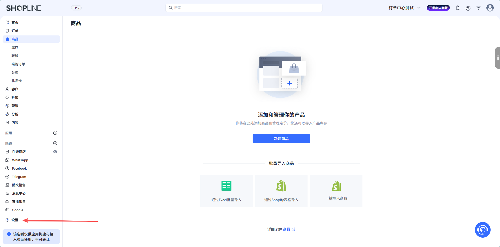
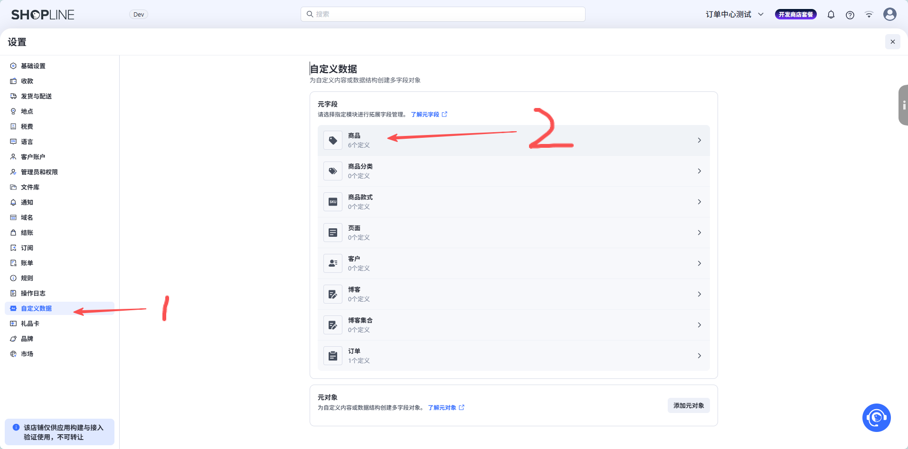
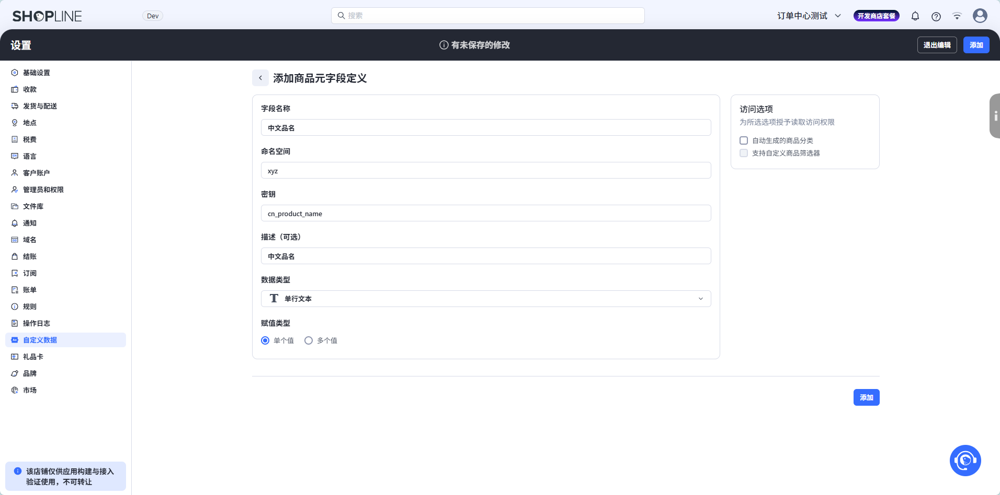
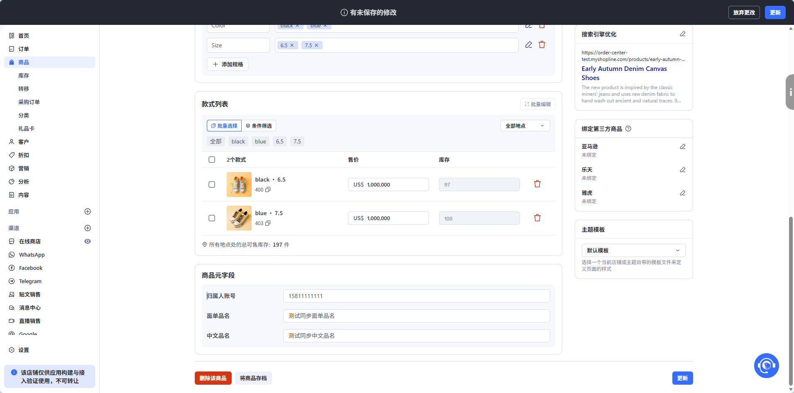
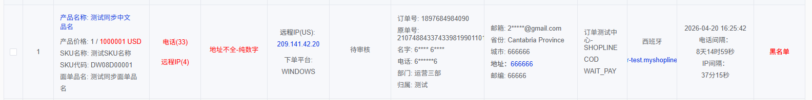

# 订单数据补全操作

通过在 Shopline 商品上配置元字段（Metafields），可以在订单同步时自动补全中文品名、面单品名、归属人等信息。

## 1. 进入系统设置

在 Shopline 后台进入系统设置。

## 2. 进入商品自定义数据

找到并进入 **商品自定义数据** 配置。

## 3. 添加需要的字段

添加需要的元字段定义。

## 4. 支持的字段列表

支持的所有字段如下（按需添加）：

| 字段名称 | 命名空间 | 密钥 | 描述 |
|---------|---------|------|------|
| 中文品名 | `xyz` | `cn_product_name` | 中文品名 |
| 面单品名 | `xyz` | `waybill_product_name` | 面单品名 |
| 归属人 | `xyz` | `owner_name` | 归属人名字，同一商城多个归属的时候可以使用 |
| 归属人账号 | `xyz` | `owner_telephone` | 归属人账号（登录手机号），同一商城多个归属的时候可以使用 |

:::info 归属人匹配规则
订单归属人按以下优先级匹配：**归属人账号** > **归属人** > **第三方商城归属**。

所有数据类型都为 **单行文本（单个值）**。
:::

## 5. 添加商品元字段

在 Shopline 的商品详情中，添加对应的商品元字段后更新。

## 6. 同步完成

配置完成后，后续同步的订单会自动携带元字段中的补全数据。

