# 实时订单同步操作

配置 Shopline 店铺连接后，系统会自动同步后续新增的订单。

## 1. 进入 Shopline 开发应用

进入 Shopline 店铺管理后台，点击左侧的 **应用** 菜单，然后点击右侧的 **开发应用**。

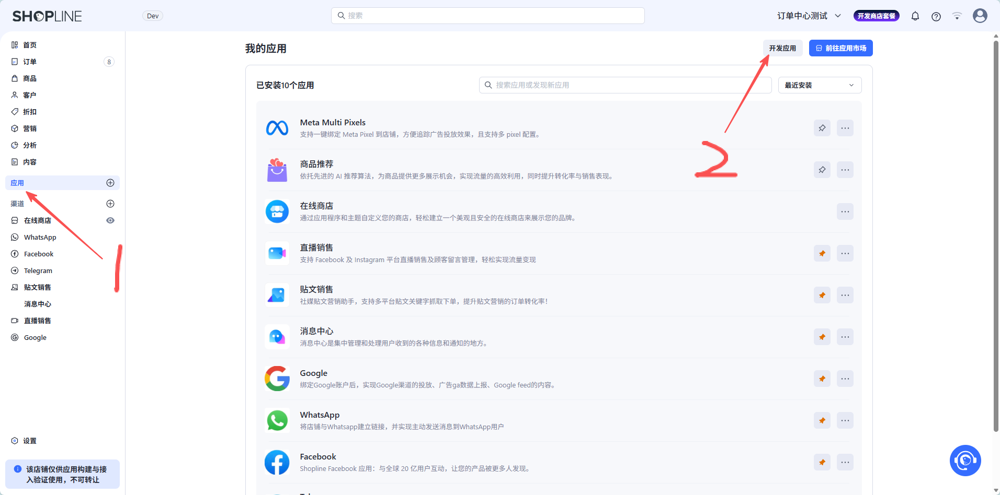

## 2. 创建应用

创建应用，名称不限。

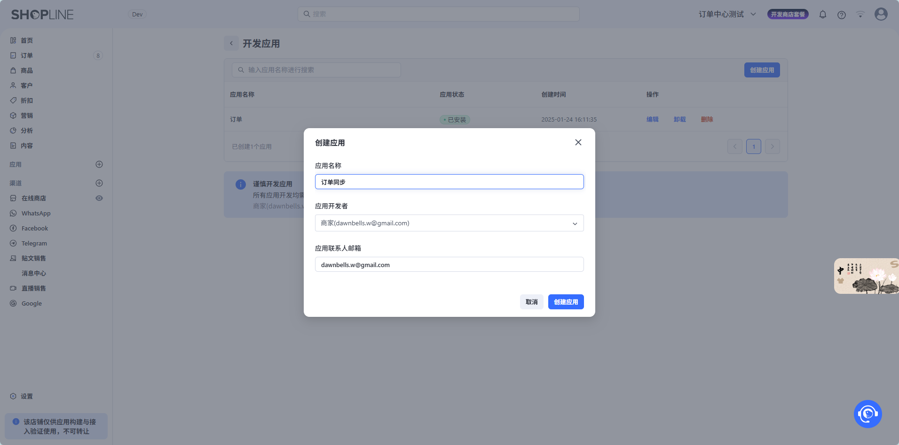

## 3. 进入应用编辑

创建应用后，点击应用操作中的 **编辑** 进入应用编辑。

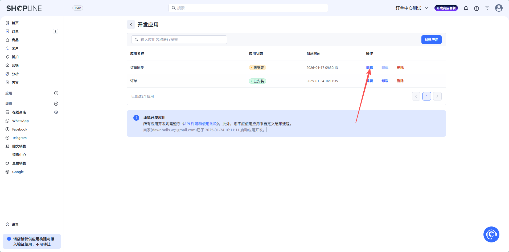

## 4. 配置 API 权限

点击 **集成后台 API** 后面的 **配置** 进入权限配置。

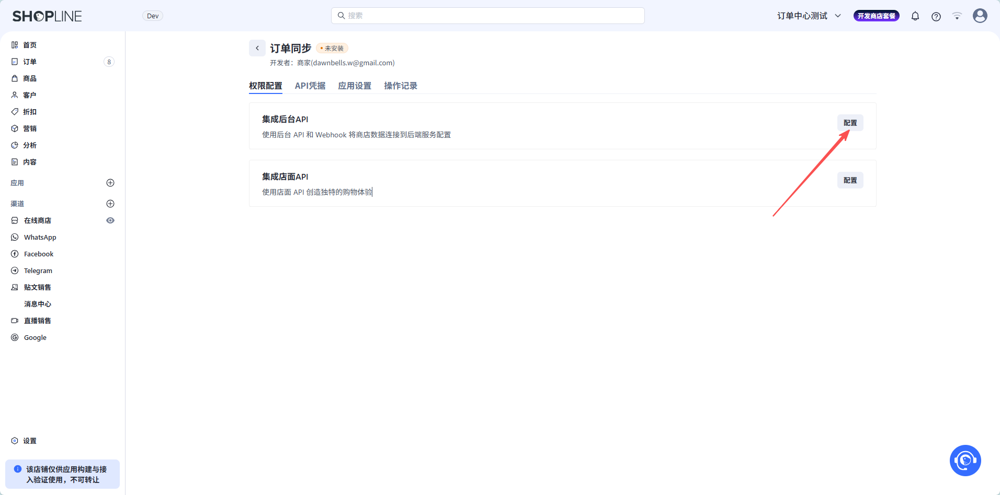

## 5. 勾选订单权限

勾选 **订单** 并保存。

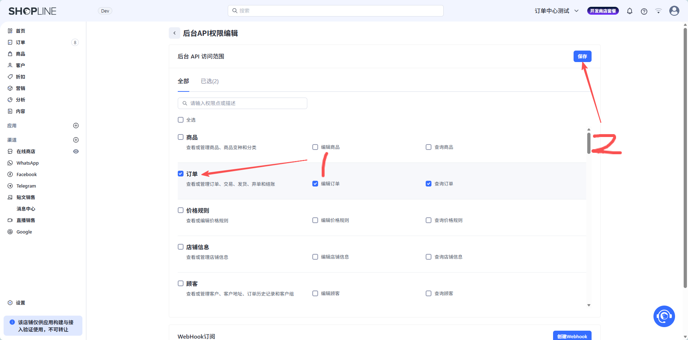

## 6. 安装应用

进入 **API 凭据** Tab，然后点击 **安装应用**。

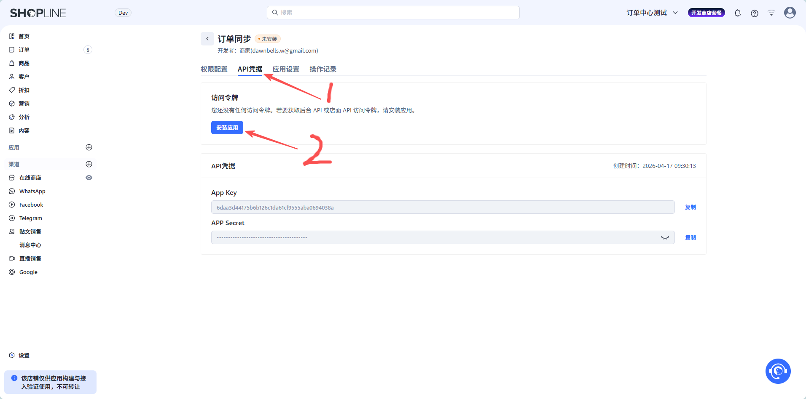

## 7. 查看访问令牌

查看后台 API 访问令牌。

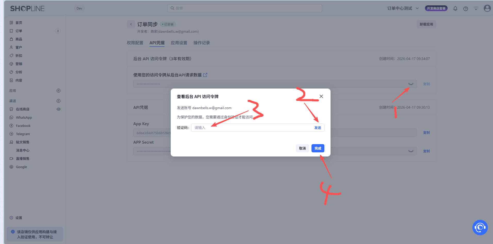

## 8. 复制访问令牌

复制后台 API 访问令牌。

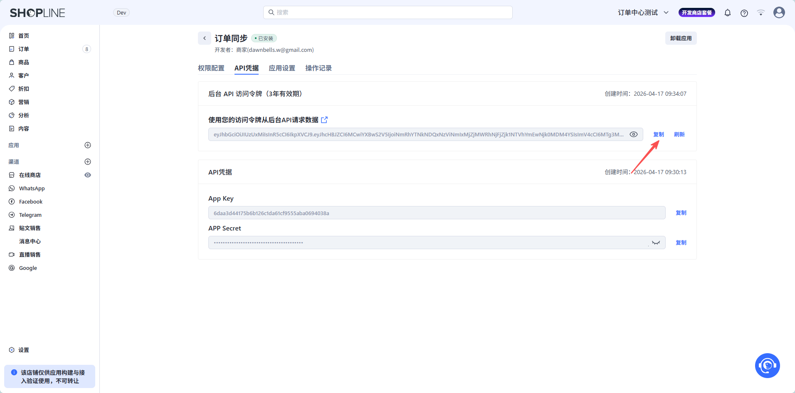

## 9. 粘贴令牌到系统

将后台 API 访问令牌粘贴到 VantaSite 系统中。

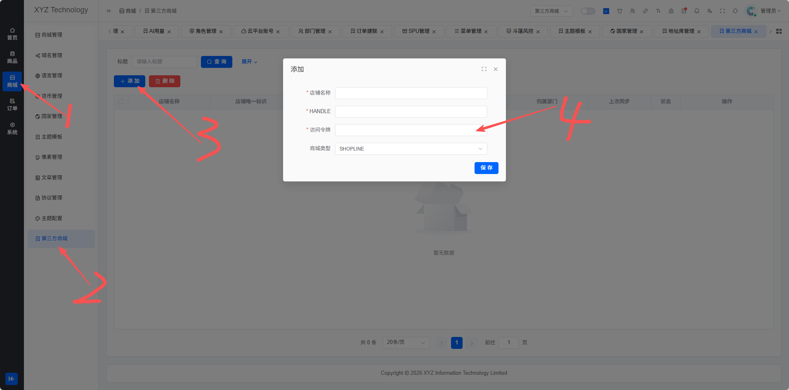

:::warning 注意
访问令牌有效期为 **三年**，过期或者刷新后需要及时更新。
:::

## 10. 获取 Shopline 店铺 HANDLE

在 Shopline 后台获取店铺 HANDLE（即 `{handle}.myshopline.com` 中的 handle 部分）。

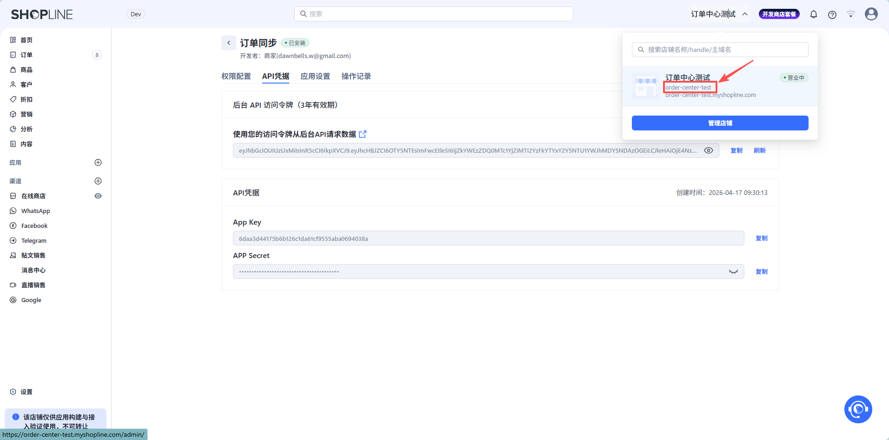

## 11. 填写 HANDLE 并保存

在 VantaSite 系统中填写 HANDLE 输入框，店铺名称随意填写，然后保存。

保存后，系统会自动同步后续新增的订单。

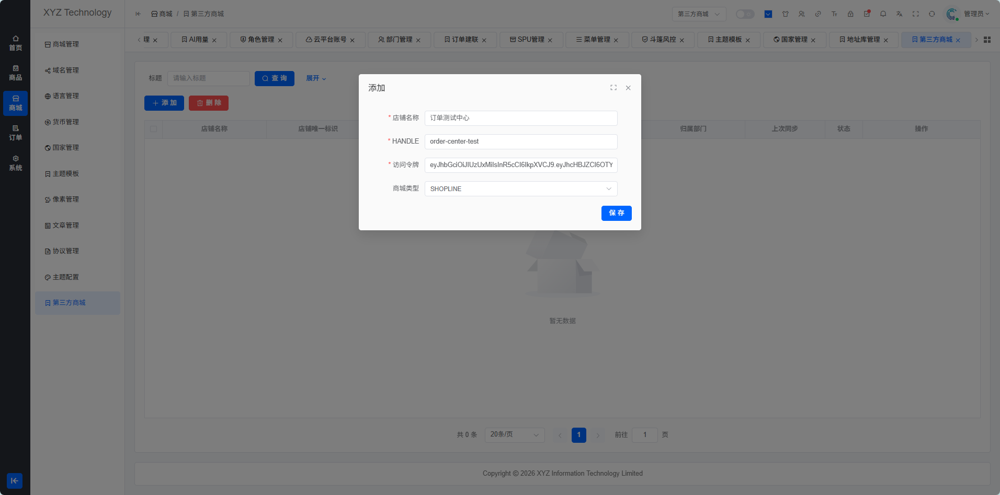
